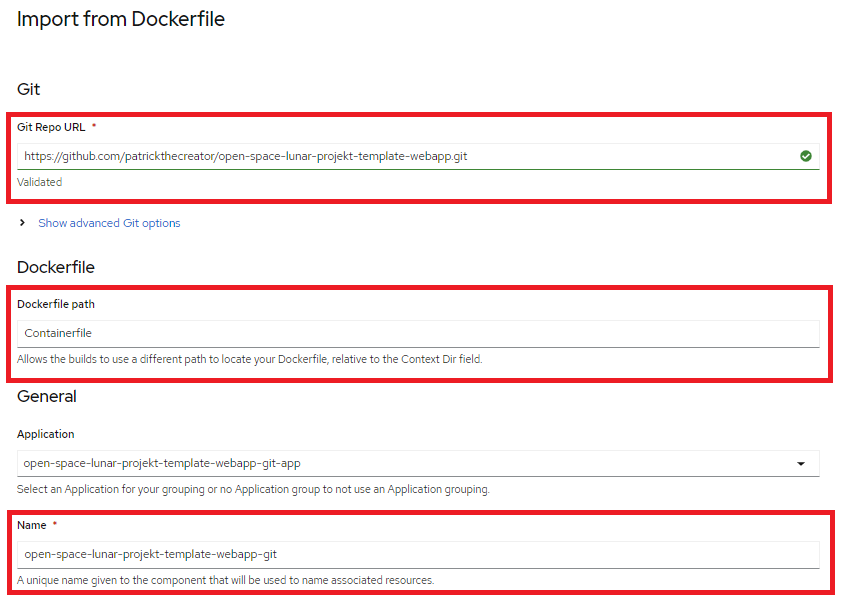
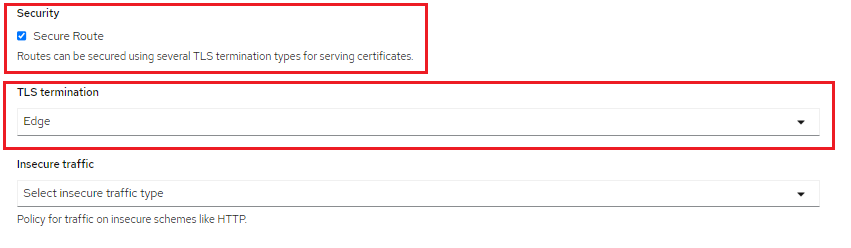

# open-space-lunar-projekt-template-webapp
#### - Template for Open-space-lunar-projekt

## How to start your webapp in a Container

### Build your image

```sh
sudo podman build -t webapp .
```

### Now your Image will appear in your local registry

```sh
sudo podman images -a
```


### Run your Container

```sh
sudo podman run -d -p 80:8080 --name httpd-app localhost/webapp
```


## How to deploy the Website with Openshift Web GUI
- Create a new openshift project
- Go to developer and go to add page
- Select From Dockerfile
- Fill the textbox settings like the screenshot shown below



- Select Secure Route and configure like in the screenshot and create your Pod



## How to deploy the Website with CLI

### Create a new application in our project

```sh
oc new-app --name=spaceluna https://github.com/patrickthecreator/open-space-lunar-projekt-template-webapp.git
```

### Create route

```sh
oc create route edge spaceluna --service=spaceluna
```


